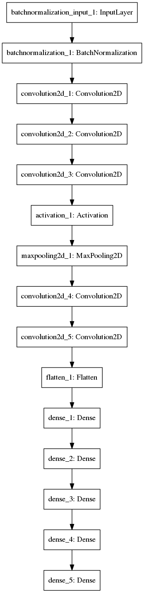

# carnd-p3
behavior cloning by cnn

#**Behavioral Cloning** 


**Behavrioal Cloning Project**

The goals / steps of this project are the following:
* Use the simulator to collect data of good driving behavior
* Build, a convolution neural network in Keras that predicts steering angles from images
* Train and validate the model with a training and validation set
* Test that the model successfully drives around track one without leaving the road
* Summarize the results with a written report
---

###Files Submitted & Code Quality

####1. Submission includes all required files and can be used to run the simulator in autonomous mode

My project includes the following files:
* model.py :containing the script to create and train the model
* drive.py :for driving the car in autonomous mode
* model.h5 :containing a trained convolution neural network 
* writeup_report.md  :summarizing the results
* examples/ :containning the videos and pictures of the reuslts


####2. Submssion includes functional code
Using the Udacity provided simulator and my drive.py file, the car can be driven autonomously around the track by executing 
```sh
python drive.py model.json
```

####3. Submssion code is usable and readable

The model.py file contains the code for training and saving the convolution neural network. The file shows the pipeline I used for training and validating the model, and it contains comments to explain how the code works.

###Model Architecture and Training Strategy

####1. An appropriate model arcthiecture has been employed

My model is based on Nvidia's '[End to End Learning for Self-Driving Cars](https://images.nvidia.com/content/tegra/automotive/images/2016/solutions/pdf/end-to-end-dl-using-px.pdf)' paper written in Keras. It starts from **line 23** and end at **line 48**. It contains **5 conv-nets, a maxPooling layer and 4 fully-connected layers**. 
##### 1.1 "Model Visualization"-Nvidia's model

##### 1.2 "Model Visualization"-my keras model


####2. Attempts to reduce overfitting in the model

The model contains maxpooling layers in order to reduce overfitting (model.py **lines31**). 

The model was trained and validated on different data sets to ensure that the model was not overfitting (code **line 35**). It's random and not exactly different. The model was tested by running it through the simulator and ensuring that the vehicle could stay on the track(see **[./examples/run1.mp4](./examples/run1.mp4)** and **[run2.mp4](./examples/run2.mp4)**), although it's not smooth enough.

####3. Model parameter tuning

The model used an adam optimizer, so the learning rate was not tuned manually (model.py line 52).

####4. Appropriate training data

I used the data provided by Udacity and all three cameras. The data path is defined in **preProcess.py**
```python
DATA_PATH = './data/driving_log.csv'
IMG_PATH = './data/'
```

###Model Architecture and Training Strategy

####1. Solution Design Approach

My first step was to use a convolution neural network model similar to the Nvidia. I thought this model might be appropriate because Nvidia did well.
In order to gauge how well the model was working, I split my image and steering angle data into a training and validation set. I found that my first model had a low mean squared error on the training set but a high mean squared error on the validation set about 0.0164. This implied that the model was overfitting. 
To combat the overfitting, I modified the model by adding a maxpooling layer, and the MSE comes to 0.0127.
At the end of the process, the vehicle is able to drive autonomously around the track without leaving the road.

####2. Final Model Architecture

The final model architecture (model.py lines 25-48) consisted of a convolution neural network with the following layers and layer sizes.
```python
# normalization layer
model.add(BatchNormalization(epsilon=0.001, mode=2, axis=1,input_shape=(64,64,3)))
# conv 1: output 24, kernel size 5x5
model.add(Convolution2D(24, 5,5, border_mode='valid', activation='relu', subsample=(2,2)))
# conv 2: output 36, kernel size 5x5
model.add(Convolution2D(36, 5,5, border_mode='valid', activation='relu', subsample=(2,2)))
# conv 3: output 48, kernel size 5x5
model.add(Convolution2D(48, 5,5, border_mode='same', subsample=(2, 2)))
model.add(Activation(activation_relu))
# maxpooling
model.add(MaxPooling2D(pool_size=(2, 2), strides=(1, 1)))
# conv 4: output 64, kernel size 3x3
model.add(Convolution2D(64, 3,3, border_mode='valid', activation='relu', subsample=(1,1)))
# conv 5: output 64, kernel size 3x3
model.add(Convolution2D(64, 3,3, border_mode='valid', activation='relu', subsample=(1,1)))
# flatten
model.add(Flatten())
# 4 fully-connected layers :
model.add(Dense(1164, activation='relu'))
model.add(Dense(100, activation='relu'))
model.add(Dense(50, activation='relu'))
model.add(Dense(10, activation='relu'))
# to output
model.add(Dense(1, activation='tanh'))
```
Here is a visualization of the architecture 


####3. Creation of the Training Set & Training Process
To capture good driving behavior, I use the data provided by Udacity, for a smoother steering with the help of joystick. The data path is defined in **preProcess.py**
```python
DATA_PATH = './data/driving_log.csv'
IMG_PATH = './data/'
```
After the collection process, I had 24,108 images of three cameras. I then preprocessed this data by crop to ROI(to have a better process speed), random mirror, random brightness(by gamma correction), and resize.
```python
def ImgGenerator(img, steering):
    """
    Augumented Img
    """
    img = crop(img, (img.shape[0]*0.35, img.shape[0]*0.9))
    img, steering = rndMirror(img, steering)
    img = rndBrightness(img)
    img = resize(img,(64,64))
    return img, steering
```

I finally randomly shuffled the data set and put 6400 of the data into a validation set.  And I pick image from one of the camera and modify the steering so that I can have more turning occasions. The number of epochs is **8**, the reason is that for there are not so many data, it will overfit. And because my computer is so weak, the trainning process takes a long time. The trainning set and validation set are picked randomly.
```python
number_of_epochs = 8
number_of_samples_per_epoch = 20032
number_of_validation_samples = 6400
```
### Results
For the results, you can simply refer to video [run1.mp4](./examples/run1.mp4), and [run2.mp4](./examples/run2.mp4). It's not so smooth while turing and is somewhat shaking during straight line. I think it's because the **lack of smooth steering data**, or **data are not enough**.
Thanks for your reading.
